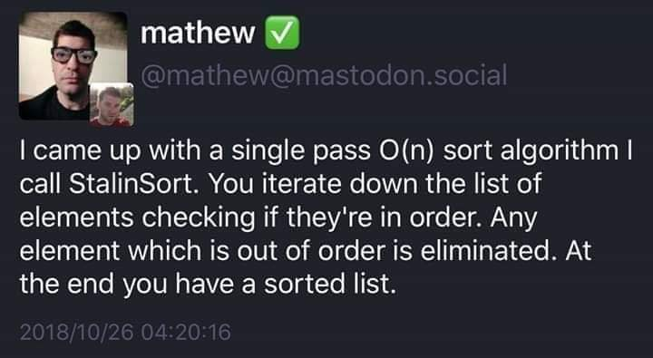

# Welcome to  the Hacktoberfest 2018 Stalin Sort :clipboard:
Stalin Sort in any language you like! What is Stalin Sort?

# What is Hacktoberfest?
Hacktoberfest is a program organised by Digital Ocean and Github, where you can easily win a T-Shirt just by making 5 pull requests in the month of October to any open source projects on Github.

## Steps to follow :scroll:

### 1. Register for Hacktoberfest
You can register from [here](https://hacktoberfest.digitalocean.com).

### 2. Fork it :fork_and_knife:

You can get your own fork/copy of [Stalin Sort](https://github.com/gustavo-depaula/stalin-sort) by using the <a href="https://github.com/Hacktoberfest-2018/Hello-world/new/master?readme=1#fork-destination-box"><kbd><b>Fork</b></kbd></a> button or clicking [this](https://github.com/gustavo-depaula/stalin-sort/new/master?readme=1#fork-destination-box).

 

### 3. Add a Program in any Language you like :rabbit2:
Once you have forked the repo, add your program in the language folder in 
main branch, if there is no language folder, make one, then add into it.
You can take a look to the [Programming Language
List](https://en.wikipedia.org/wiki/List_of_programming_languages) in Wikipedia
to create a new one Stalin Sort!
For a PR to be approved and merged please note 
- we allow maximum of 5000 additions (your prwill get close if its exceeds, but you can ask maintainer for reviewing this)
- we dont allow deletions of others files or code.
- we dont allow files to be directly added in root directory of project, add them in there language folder
### 4. Ready, Steady, Go... :turtle: :rabbit2:

Once you have completed these steps, you are ready to start contributing 
by checking our `Help Wanted` issues and creating [pull requests](https://github.com/Hacktoberfest-2018/Hello-world/pulls).

### 5. Give this Project a Star :star:

If you liked working on this project, please share this project as much 
as you can and star this project to help as many people in open source as you can.

:tada: :confetti_ball: :smiley: _**Happy Contributing**_ :smiley: :confetti_ball: :tada:

